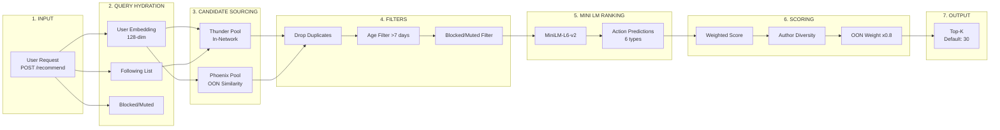
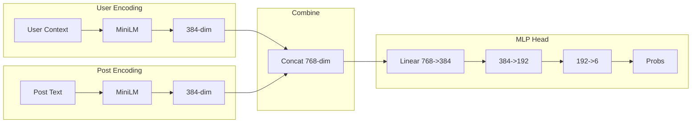
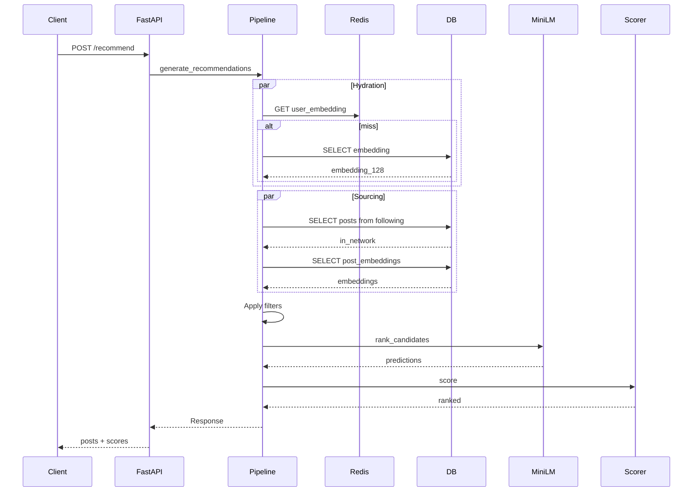

# Reranking Algorithm Architecture - Demo Reference

This document provides a comprehensive overview of the reranking system with detailed notes and file references for demo presentations.

---

## Main Architecture Overview



---

## Component Files Reference

| Component | File | Purpose |
|-----------|------|---------|
| **API Entry** | `api/recommendations.py` | HTTP endpoint |
| **Pipeline** | `services/pipeline.py` | Main flow |
| **Two-Tower** | `services/two_tower.py` | Similarity |
| **MiniLM** | `services/minilm_ranker.py` | Action predictions |
| **Filters** | `services/filters.py` | Filtering |
| **Scoring** | `services/scoring.py` | Multi-stage scoring |
| **Online Learning** | `services/online_learning.py` | Real-time updates |

---

## 1. Input Layer

**File:** `backend/app/api/recommendations.py:22-44`

```
POST /api/v1/recommend
Body: {user_id: string, limit: number}
```

Returns: posts[], scores[], total_candidates, processing_time_ms

---

## 2. Query Hydration

**File:** `pipeline.py:28-140`

Parallel fetch: user_embedding, following, blocked/muted
Cache: 5-minute TTL

Tables: user_embeddings, follows, blocks, mutes

---

## 3. Candidate Sourcing

**File:** `pipeline.py:142-234`

**Thunder Pool:** Posts from followed users (limit: 300)
**Phoenix Pool:** Two-tower similarity retrieval (limit: 300)

Similarity = dot(user_emb, post_emb)

---

## 4. Pre-Scoring Filters

**File:** `filters.py`

1. DropDuplicatesFilter
2. CoreDataHydrationFilter  
3. AgeFilter (>7 days)
4. SelfTweetFilter
5. AuthorSocialgraphFilter

---

## 5. MiniLM Ranking

**File:** `minilm_ranker.py:44-190`

Model: sentence-transformers/all-MiniLM-L6-v2 (frozen)
Output: 384-dim embeddings

Action Prediction Head: 768->384->192->6 (sigmoid)

| Action | Weight |
|--------|--------|
| like | 1.0 |
| reply | 1.2 |
| repost | 1.0 |
| not_interested | -2.0 |
| block_author | -10.0 |
| mute_author | -5.0 |

---

## 6. Multi-Stage Scoring

**File:** `scoring.py`

**Stage 1:** score = sum(weight * P(action))

**Stage 2:** multiplier = 0.3 + 0.7^position (diversity)

**Stage 3:** OON posts x 0.8 penalty

---

## 7. Output Layer

**File:** `pipeline.py:327-352`

Top 30 posts returned with scores and timing

---

## Online Learning

**File:** `online_learning.py`

Signal Map: like(+1.0), reply(+1.5), repost(+1.0), block(-2.0), mute(-1.5)

User update: new_emb = (1-a)*current + a*signal*post_emb
Post update: new_emb = current + 0.01*signal*user_emb

Auto-init after 5 engagements

---

## Action Prediction Architecture



---

## Data Flow Sequence


