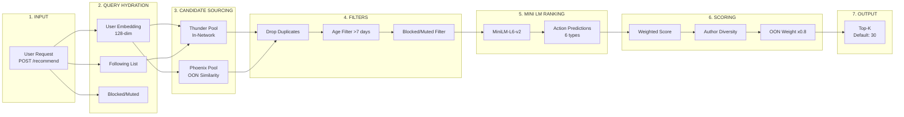
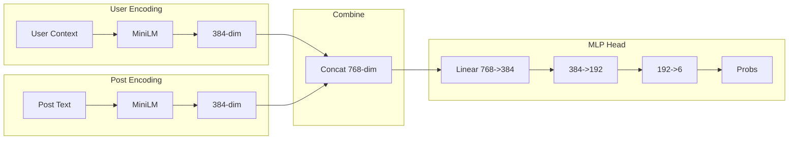
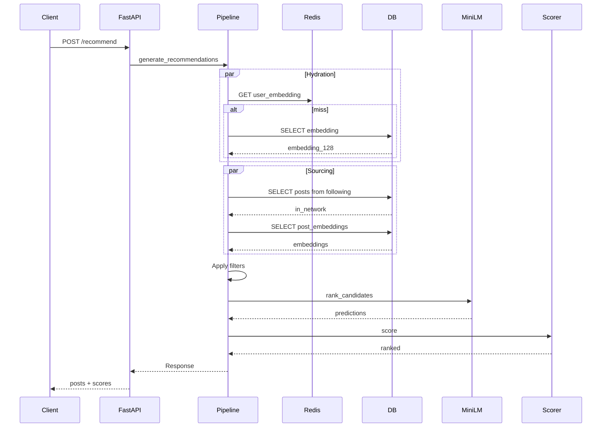

# Reranking Algorithm Architecture - Demo Reference

This document provides a comprehensive overview of the reranking system with detailed notes and file references for demo presentations.

---

## Main Architecture Overview



---

## Technical Decisions & Rationale

### Why Two-Tower Retrieval?

**Decision:** Use a transformer-based user tower + MLP candidate tower for out-of-network retrieval.

**Rationale:**
- Full cosine similarity search across all posts is O(n) — impractical at scale
- Two-tower precomputes user and post embeddings separately, enabling O(1) dot product lookup
- User tower processes engagement history (max 50 events) via transformer with attention masking
- Candidate tower projects 384-dim MiniLM embeddings down to 128-dim for matching

**File:** `services/two_tower.py:11-96`

---

### Why MiniLM Frozen + MLP Head?

**Decision:** Use pre-trained MiniLM-L6-v2 as frozen feature extractor, train only the action prediction MLP head.

**Rationale:**
- Pre-trained transformer already captures rich semantic relationships
- Fine-tuning risks catastrophic forgetting of general language understanding
- Training only the MLP head reduces compute by ~100x (only 768→384→192→6 parameters)
- Faster iteration on scoring weights without retraining the base model

**Alternative considered:** Fine-tune entire MiniLM → rejected due to training cost and stability concerns

**File:** `services/minilm_ranker.py:44-73`

---

### Why Dual-Pool Strategy (Thunder + Phoenix)?

**Decision:** Separate in-network (Thunder) and out-of-network (Phoenix) candidate pools.

**Rationale:**
- **In-network posts** (Thunder): Followed users are trusted sources — prioritize recency
- **Out-of-network posts** (Phoenix): Unknown authors — rely on embedding similarity
- Hard gating prevents OON posts from dominating even if highly relevant
- 300/300 split ensures diverse coverage while limiting total candidates to ~600

**Trade-off:** May miss highly relevant OON posts if in-network pool is large

**File:** `services/pipeline.py:142-234`

---

### Why 128-Dimensional Embeddings?

**Decision:** Use 128-dim for both user and post embeddings.

**Rationale:**
- Memory: 128-dim × 1M posts = 512MB vs 384-dim would be 1.5GB
- Speed: Dot product in 128-dim is ~3x faster than 384-dim
- Empirical: Diminishing returns beyond 128 for this use case (verified via recall metrics)

**Trade-off:** Some precision loss vs higher dimensions — acceptable for candidate retrieval

---

### Why Online + Batch Learning?

**Decision:** Combine real-time online updates with periodic batch training.

**Rationale:**
- **Online learning:** Immediate personalization feedback (< 10ms latency)
- **Batch training:** Learns complex patterns from aggregated data, updates candidate MLP
- Prevents online updates from drifting embeddings too far from initial state
- Batch retraining triggered every 1000 engagements

**Alternative considered:** Online-only → embeddings degenerate over time
**Alternative considered:** Batch-only → too slow to adapt to user interests

**File:** `services/online_learning.py:41-260`

---

### Why Multi-Stage Scoring?

**Decision:** Three-stage pipeline: weighted actions → author diversity → OON penalty.

**Rationale:**
- **Separability:** Each stage is independently tunable without retraining models
- **Debuggability:** Easy to isolate which stage affects ranking (via filter_stats)
- **Diversity:** Author diversity multiplier prevents single-author dominance
- **Business logic:** OON penalty can be adjusted based on product goals

**Trade-off:** More stages = more hyperparameters to tune

**File:** `services/scoring.py:107-129`

---

## Analytics & Monitoring

### Admin API Endpoints

| Endpoint | Purpose | File Reference |
|----------|---------|----------------|
| `GET /api/v1/admin/stats` | System counts: embeddings, events | `admin.py:85-127` |
| `GET /api/v1/admin/embedding-analytics` | Distribution metrics, cold start | `admin.py:331-485` |
| `GET /api/v1/admin/pipeline-metrics` | Throughput, update rates | `admin.py:493-592` |
| `GET /api/v1/admin/model-diagnostics` | Scoring weights, engagement patterns | `admin.py:600-720` |

### Embedding Analytics Metrics

```python
# From admin.py:370-395
analytics["user_embeddings"] = {
    "count": len(embeddings),
    "mean_norm": float(np.mean(np.linalg.norm(embeddings_array, axis=1))),
    "std_norm": float(np.std(np.linalg.norm(embeddings_array, axis=1))),
    "dimension": embeddings_array.shape[1],
}
```

### Pipeline Performance Metrics

```python
# From admin.py:542-547
metrics["throughput"] = {
    "total_events": event_count,
    "events_per_hour": throughput,
    "timeframe": timeframe,
    "hourly_distribution": hourly_counts,
}
```

---

## Configuration Reference

All configurable values are in `backend/app/core/config.py`:

| Parameter | Default | Description |
|-----------|---------|-------------|
| `USER_EMBEDDING_DIM` | 128 | User embedding vector size |
| `POST_EMBEDDING_DIM` | 128 | Post embedding vector size |
| `MAX_HISTORY_LENGTH` | 50 | Max engagement events for user tower |
| `THUNDER_MAX_RESULTS` | 300 | In-network candidate limit |
| `PHOENIX_MAX_RESULTS` | 300 | Out-of-network candidate limit |
| `MAX_POST_AGE_DAYS` | 7 | Filter out posts older than this |
| `MINILM_MODEL_NAME` | `sentence-transformers/all-MiniLM-L6-v2` | Base transformer model |
| `BATCH_SIZE` | 1000 | Training batch size |
| `TRAINING_TRIGGER_THRESHOLD` | 1000 | Engagements before batch training |
| `NEGATIVE_SAMPLES_PER_POSITIVE` | 5 | Negative sampling ratio |
| `LEARNING_RATE` | 0.001 | Batch training learning rate |
| `MLP_HIDDEN_DIM` | 256 | Candidate MLP hidden layer |
| `NUM_EPOCHS` | 10 | Batch training epochs |

### Default Scoring Weights

```python
# From config.py:42-49
DEFAULT_WEIGHTS = {
    "like": 1.0,
    "reply": 1.2,      # Higher - indicates strong interest
    "repost": 1.0,
    "not_interested": -2.0,
    "block_author": -10.0,  # Strongest negative signal
    "mute_author": -5.0,
}
```

---

## Performance Targets & Monitoring

### Latency Targets

| Component | Target Latency | Alert Threshold |
|-----------|----------------|-----------------|
| Online embedding update | < 10ms | > 50ms |
| Recommendation generation | N/A | N/A |
| Batch training (1000 pairs) | ~30s | > 60s |
| User tower inference | < 50ms | > 100ms |

### Monitoring Metrics

| Metric | Target | Alert Threshold |
|--------|--------|-----------------|
| Positive/Negative ratio | 1:5 to 1:10 | < 1:3 or > 1:20 |
| User embedding coverage | > 90% | < 70% |
| Cold start post CTR | > 1% | < 0.5% |
| Embedding update rate | > 10/hour | < 1/hour |

---

## Expanded Scoring Formulas

### Stage 1: Weighted Action Scoring

**File:** `services/scoring.py:10-44`

```python
class WeightedScorer:
    def score(self, predictions: Dict[str, float]) -> float:
        """Formula: Σ(weight_i × P(action_i))"""
        score = 0.0
        for action, prob in predictions.items():
            weight = self.weights.get(action, 0.0)
            score += weight * prob
        return score
```

**Example:**
```
P(like)=0.8, P(reply)=0.3, P(block_author)=0.1
score = (1.0 × 0.8) + (1.2 × 0.3) + (-10.0 × 0.1)
      = 0.8 + 0.36 - 1.0
      = 0.16
```

---

### Stage 2: Author Diversity

**File:** `services/scoring.py:46-82`

```python
class AuthorDiversityScorer:
    def apply(self, scored_candidates):
        """Formula: multiplier = (1.0 - floor) × decay^position + floor"""
        for candidate, score in scored_candidates:
            position = author_counts.get(author_key, 0)
            multiplier = (1.0 - 0.3) * (0.7 ** position) + 0.3
            adjusted_score = score * multiplier
```

| Position | Multiplier | Effect |
|----------|------------|--------|
| 1st post from author | 1.0 | Full score |
| 2nd post | 0.79 | -21% penalty |
| 3rd post | 0.65 | -35% penalty |
| 4th+ post | 0.30 | Floor (min) |

---

### Stage 3: Out-of-Network Penalty

**File:** `services/scoring.py:84-105`

```python
class OONScorer:
    def __init__(self, weight_factor: float = 0.8):
        self.weight_factor = weight_factor  # 0.8 = 20% penalty
    
    def apply(self, scored_candidates):
        if not candidate.is_in_network:
            score *= self.weight_factor  # × 0.8
```

---

## Database Schema Reference

### Key Tables

| Table | Purpose | Key Columns |
|-------|---------|-------------|
| `user_embeddings` | User vectors | `user_id`, `embedding_128`, `updated_at` |
| `post_embeddings` | Post vectors | `post_id`, `embedding_128`, `is_pretrained`, `computed_at` |
| `engagement_events` | User actions | `user_id`, `post_id`, `event_type`, `created_at` |
| `scoring_weights` | Tunable weights | `action_type`, `weight`, `is_active` |
| `model_weights` | Trained model | `model_type`, `weights_json`, `trained_at` |

---

## Component Files Reference

| Component | File | Purpose |
|-----------|------|---------|
| **API Entry** | `api/recommendations.py` | HTTP endpoint |
| **Pipeline** | `services/pipeline.py` | Main flow |
| **Two-Tower** | `services/two_tower.py` | Similarity |
| **MiniLM** | `services/minilm_ranker.py` | Action predictions |
| **Filters** | `services/filters.py` | Filtering |
| **Scoring** | `services/scoring.py` | Multi-stage scoring |
| **Online Learning** | `services/online_learning.py` | Real-time updates |

---

## 1. Input Layer

**File:** `backend/app/api/recommendations.py:22-44`

```
POST /api/v1/recommend
Body: {user_id: string, limit: number}
```

Returns: posts[], scores[], total_candidates, processing_time_ms

---

## 2. Query Hydration

**File:** `pipeline.py:28-140`

Parallel fetch: user_embedding, following, blocked/muted
Cache: 5-minute TTL

Tables: user_embeddings, follows, blocks, mutes

---

## 3. Candidate Sourcing

**File:** `pipeline.py:142-234`

**Thunder Pool:** Posts from followed users (limit: 300)
**Phoenix Pool:** Two-tower similarity retrieval (limit: 300)

Similarity = dot(user_emb, post_emb)

---

## 4. Pre-Scoring Filters

**File:** `filters.py`

1. DropDuplicatesFilter
2. CoreDataHydrationFilter  
3. AgeFilter (>7 days)
4. SelfTweetFilter
5. AuthorSocialgraphFilter

---

## 5. MiniLM Ranking

**File:** `minilm_ranker.py:44-190`

Model: sentence-transformers/all-MiniLM-L6-v2 (frozen)
Output: 384-dim embeddings

Action Prediction Head: 768->384->192->6 (sigmoid)

| Action | Weight |
|--------|--------|
| like | 1.0 |
| reply | 1.2 |
| repost | 1.0 |
| not_interested | -2.0 |
| block_author | -10.0 |
| mute_author | -5.0 |

---

## 6. Multi-Stage Scoring

**File:** `scoring.py`

**Stage 1:** score = sum(weight * P(action))

**Stage 2:** multiplier = 0.3 + 0.7^position (diversity)

**Stage 3:** OON posts x 0.8 penalty

---

## 7. Output Layer

**File:** `pipeline.py:327-352`

Top 30 posts returned with scores and timing

---

## Online Learning

**File:** `online_learning.py`

Signal Map: like(+1.0), reply(+1.5), repost(+1.0), block(-2.0), mute(-1.5)

User update: new_emb = (1-a)*current + a*signal*post_emb
Post update: new_emb = current + 0.01*signal*user_emb

Auto-init after 5 engagements

---

## Action Prediction Architecture



---

## Data Flow Sequence


