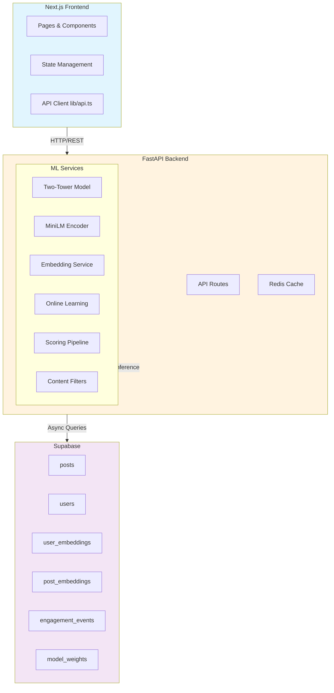
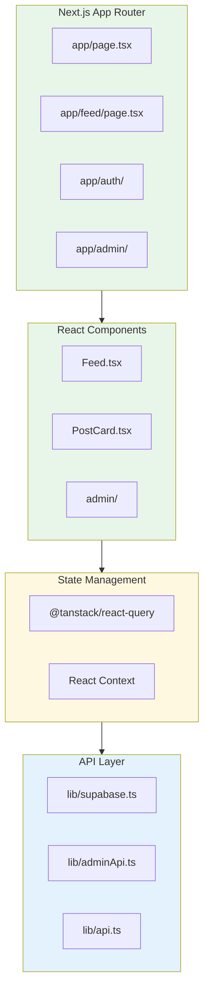
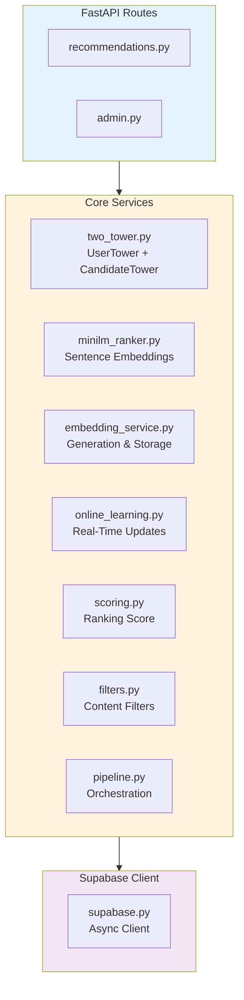

# Rank-Lab System Design

Rank-Lab is a personalized content recommendation system inspired by X's open-source algorithm. This document describes the architecture of the entire system, from frontend to backend to ML models.

## Architecture Overview

### Full System Architecture

### Frontend Architecture

### Backend Architecture

## Quick Links

| Document | Description |
|----------|-------------|
| [Data Flow](data-flow.md) | Request lifecycle and data transformations |
| [Two-Tower Model](two-tower-model.md) | Neural recommendation architecture |
| [Embeddings](embeddings.md) | Embedding generation and storage |
| [Online Learning](online-learning.md) | Real-time personalization updates |

## Tech Stack Summary

| Layer | Technology |
|-------|------------|
| **Frontend** | Next.js 14, React, TypeScript, Tailwind CSS |
| **Backend** | FastAPI, Python 3.11+, Uvicorn |
| **Database** | Supabase (PostgreSQL) |
| **ML Framework** | PyTorch 2.1, Transformers 4.36 |
| **Embeddings** | MiniLM-L6-v2 (384-dim), Two-Tower (128-dim) |
| **Caching** | Redis (async) |
| **API Docs** | Swagger UI, ReDoc |
