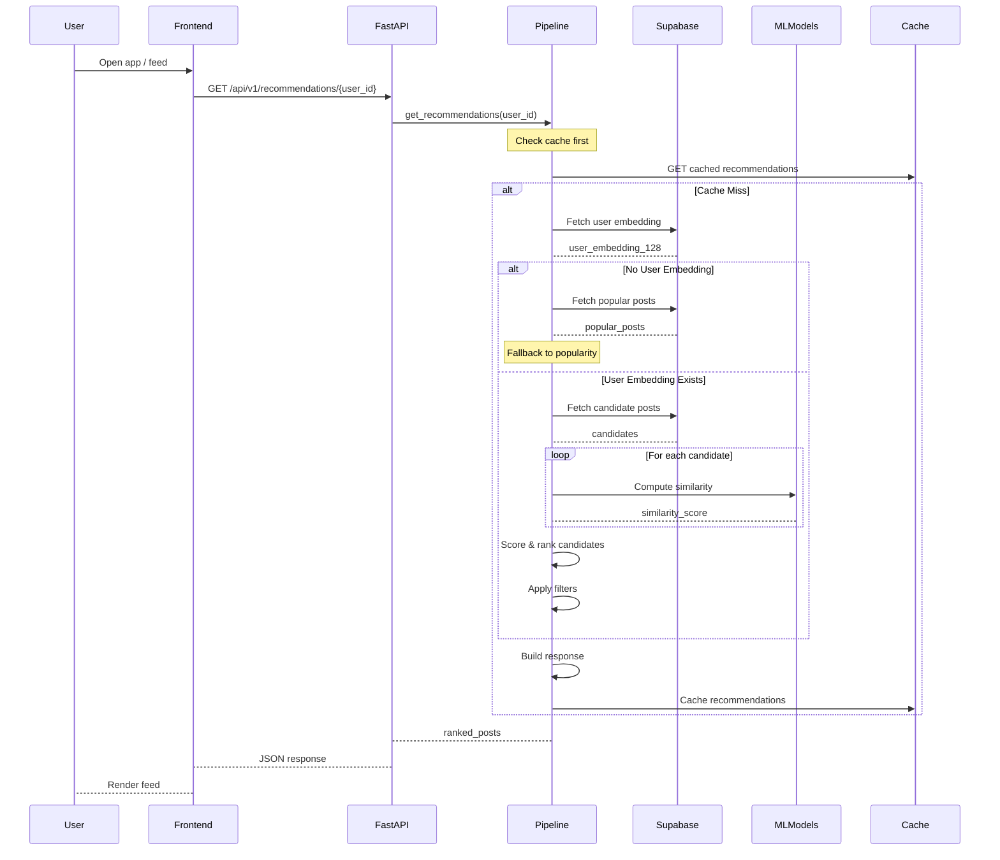

# Data Flow

This document describes how data flows through the system, from user requests to recommendation responses to engagement feedback loops.

## Request Lifecycle

### Recommendation Request Flow



### Engagement Event Flow

```mermaid
flowchart LR
    subgraph Input["User Action"]
        Action["Like/Reply/Repost\n/View"]
    end

    subgraph Processing["FastAPI"]
        Endpoint["POST /engage"]
        Validate["Validate JWT"]
        Log["Log to DB"]
        Learn["Trigger Learning"]
    end

    subgraph Storage["Supabase"]
        Events["engagement_events\ntable"]
        Cache["Redis Cache"]
    end

    subgraph ML["Online Learning"]
        UpdateUser["Update user embedding"]
        UpdatePost["Update post embedding"]
        Train["Batch training trigger"]
    end

    Input --> Processing
    Processing --> Storage
    Processing --> ML

    style Input fill:#e8f5e9
    Processing fill:#fff3e0
    Storage fill:#f3e5f5
    ML fill:#e3f2fd
```

## Training Data Pipeline

```mermaid
flowchart TB
    subgraph Sources["Data Sources"]
        Events["engagement_events\n(positive: like, reply, repost)"]
        Views["engagement_events\n(negative: view, skip)"]
    end

    subgraph Collection["Pair Collection"]
        Positive["Positive pairs\n(user, post, label=1)"]
        Negative["Negative pairs\n(user, post, label=0)"]
    end

    subgraph Training["Batch Training"]
        Contrastive["Contrastive Loss\nCandidate Tower"]
        Triplet["Triplet Loss\nUser Tower"]
    end

    subgraph Storage2["Model Storage"]
        Weights["model_weights\ntable"]
        Embeddings["Updated embeddings\nin tables"]
    end

    Sources --> Collection
    Collection --> Training
    Training --> Storage2

    style Sources fill:#e8f5e9
    Collection fill:#fff3e0
    Training fill:#e3f2fd
    Storage2 fill:#f3e5f5
```

## Data Transformations

### Content to Embedding Pipeline

```
┌─────────────────┐     ┌─────────────────┐     ┌─────────────────┐
│   Post Content  │────▶│   MiniLM-L6-v2  │────▶│   384-dim       │
│   (Text)        │     │   Encoder       │     │   base_emb      │
└─────────────────┘     └─────────────────┘     └────────┬────────┘
                                                       │
┌─────────────────┐     ┌─────────────────┐     ┌───────▼────────┐
│ User Embedding  │◀───▶│  Candidate MLP  │◀────│   384-dim      │
│ (128-dim)       │     │   (384→256→128) │     │   projected     │
└─────────────────┘     └─────────────────┘     └─────────────────┘
```

### Engagement to User Embedding

```
┌──────────────────────────────────────────────────────────────────┐
│                    Engagement History                             │
│  ┌─────────┐ ┌─────────┐ ┌─────────┐ ┌─────────┐ ┌─────────┐    │
│  │ Post 1  │ │ Post 2  │ │ Post 3  │ │ Post 4  │ │ Post 5  │    │
│  │ (+1.0)  │ │ (+1.0)  │ │ (+0.5)  │ │ (-1.0)  │ │ (+1.0)  │    │
│  └────┬────┘ └────┬────┘ └────┬────┘ └────┬────┘ └────┬────┘    │
│       │            │            │            │            │        │
│       └────────────┴─────┬──────┴────────────┴────────────┘        │
│                          │                                       │
└──────────────────────────┼───────────────────────────────────────┘
                           ▼
            ┌───────────────────────────┐
            │    User Tower Transformer │
            │    (4 heads, 2 layers)    │
            └─────────────┬─────────────┘
                          │
                          ▼
            ┌───────────────────────────┐
            │   128-dim User Embedding  │
            │   (L2 normalized)         │
            └───────────────────────────┘
```

## Cache Invalidation Flow

```mermaid
flowchart TB
    subgraph Trigger["Invalidation Triggers"]
        NewPost["New post created"]
        EmbedUpdate["Embedding updated"]
        UserAction["User follows/unfollows"]
    end

    subgraph Check["Cache Check"]
        Key["Build cache key\nuser_id + timestamp"]
        Lookup["Check Redis"]
    end

    subgraph Action["Invalidation Action"]
        Delete["DELETE key"]
        Rebuild["Trigger background rebuild"]
    end

    Trigger --> Check
    Check -->|Cache exists| Action
    Action -->|Next request| Check

    style Trigger fill:#e8f5e9
    Check fill:#fff3e0
    Action fill:#e3f2fd
```
