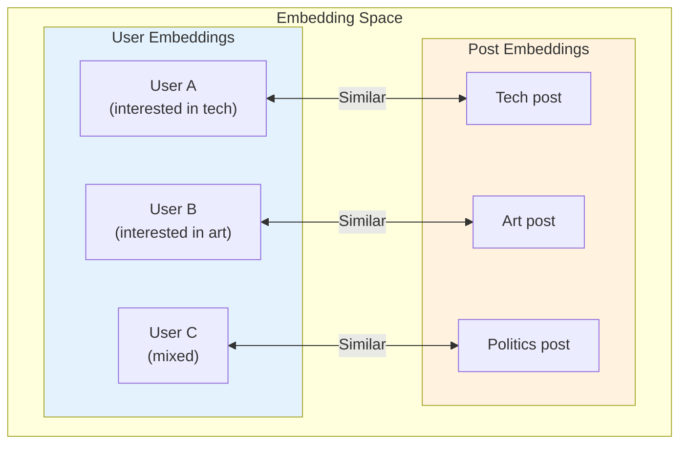
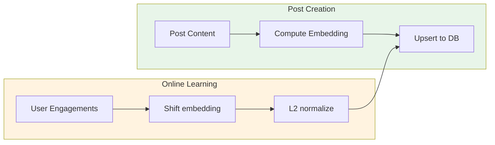
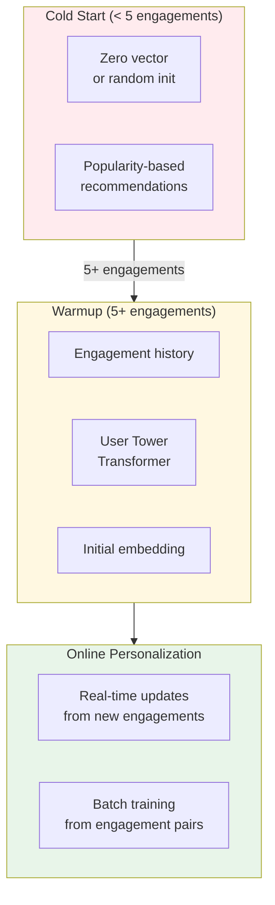
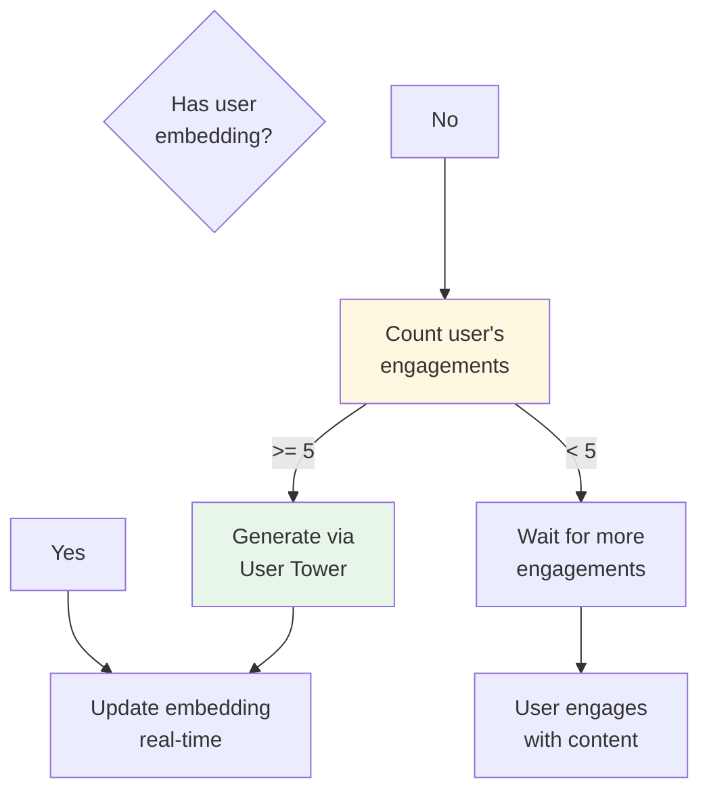
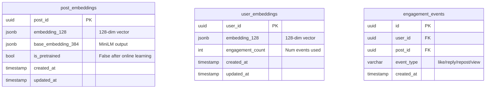
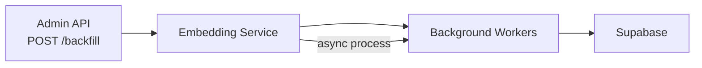
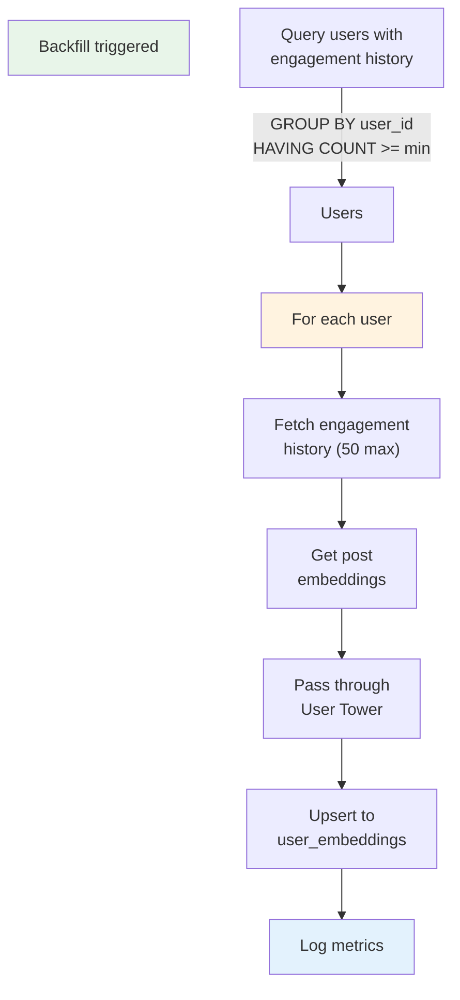
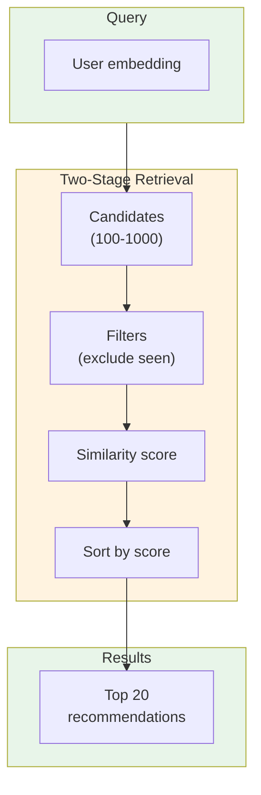
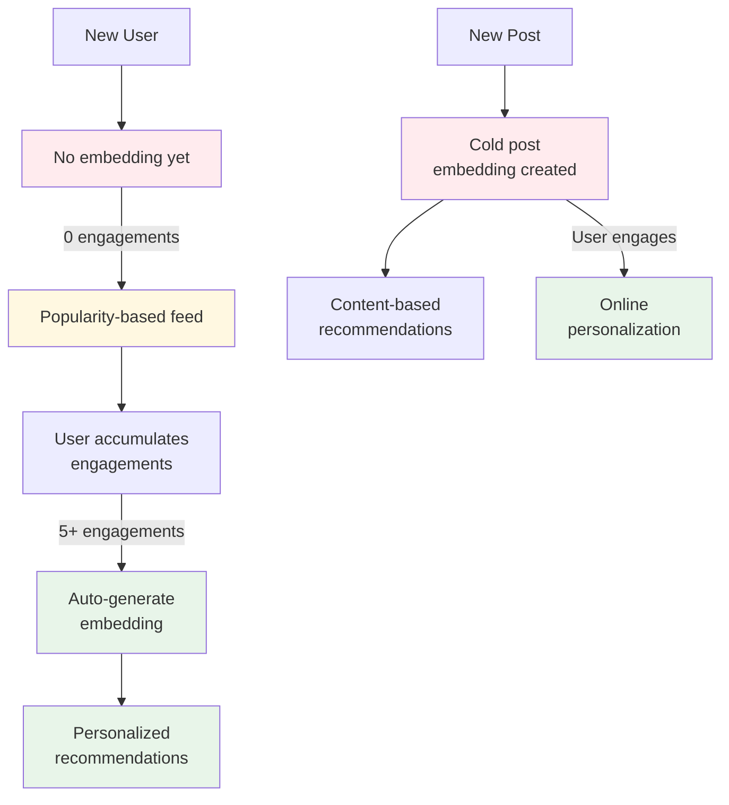

# Embeddings System

Embeddings are 128-dimensional vectors that represent users and posts in a shared semantic space. Similar users and posts are close together, enabling personalized recommendations.

## Embedding Types



## Post Embedding Pipeline



### Initial Computation

| Step | Component | Output |
|------|-----------|--------|
| 1 | MiniLM-L6-v2 Encoder | 384-dim base embedding |
| 2 | Candidate Tower MLP | 128-dim projected embedding |
| 3 | L2 Normalization | Unit sphere (norm=1) |
| 4 | Database Upsert | `post_embeddings` table |

### Online Update Formula

```
new_embedding = normalize(current + learning_rate * signal * user_embedding)
```

| Signal | Meaning | Update Direction |
|--------|---------|-----------------|
| +1.0 | Like/Repost | Move toward user |
| +1.5 | Reply | Strong move toward user |
| -1.0 | Not interested | Move away from user |
| -2.0 | Block author | Strong move away |

## User Embedding Pipeline



### Auto-Initialization Trigger



### Moving Average Update

```
alpha = min(0.1, 1.0 / (engagement_count + 1))

new_embedding = (1 - alpha) * current + alpha * signal * post_embedding
new_embedding = normalize(new_embedding)
```

## Embedding Storage Schema



### Table: `post_embeddings`

| Column | Type | Description |
|--------|------|-------------|
| `post_id` | UUID | FK to posts table |
| `embedding_128` | JSONB | 128-dim embedding as array |
| `base_embedding_384` | JSONB | 384-dim MiniLM output |
| `is_pretrained` | BOOL | True if never personalized |

### Table: `user_embeddings`

| Column | Type | Description |
|--------|------|-------------|
| `user_id` | UUID | FK to users table |
| `embedding_128` | JSONB | 128-dim user embedding |
| `engagement_count` | INT | Number of engagements used |

## Backfill Operations

### Triggering Backfill



### Backfill Flow



## Similarity Search



## Cold Start Handling


