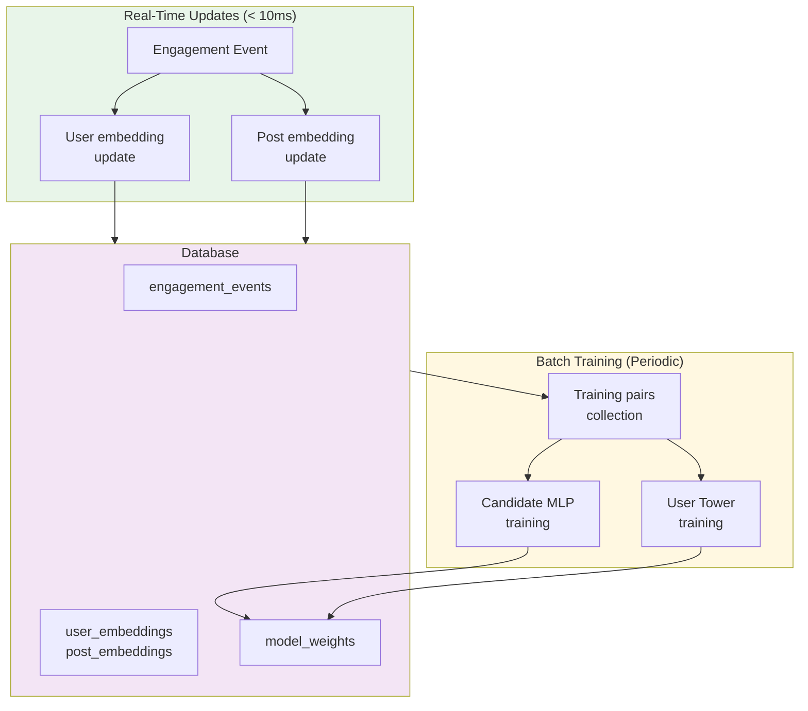
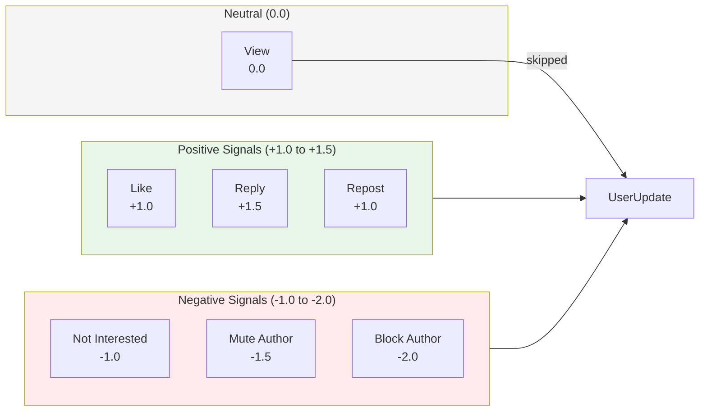
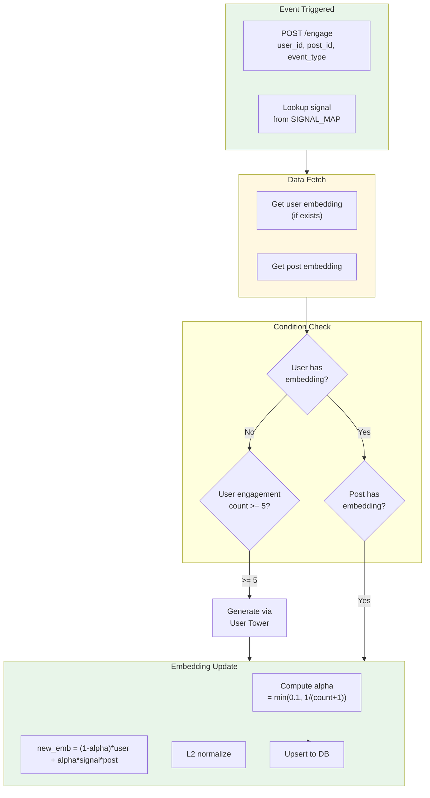
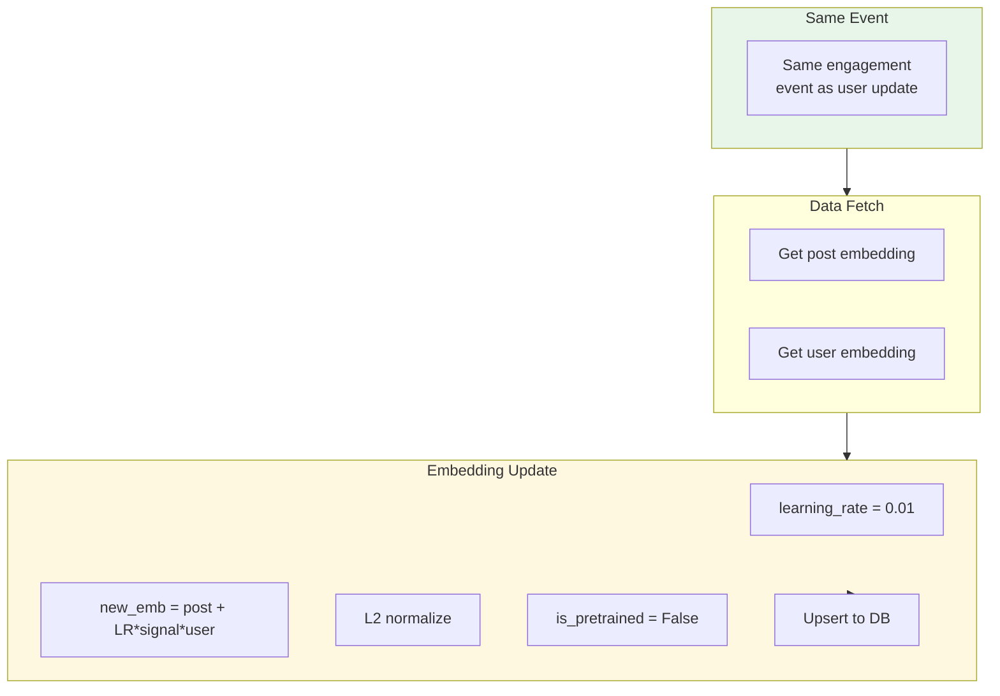
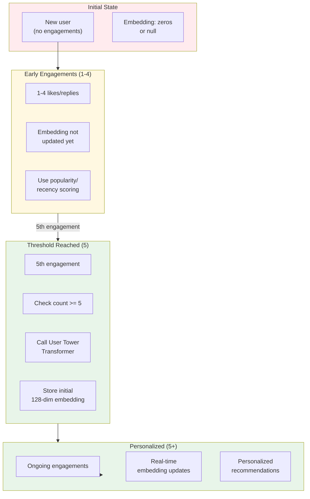
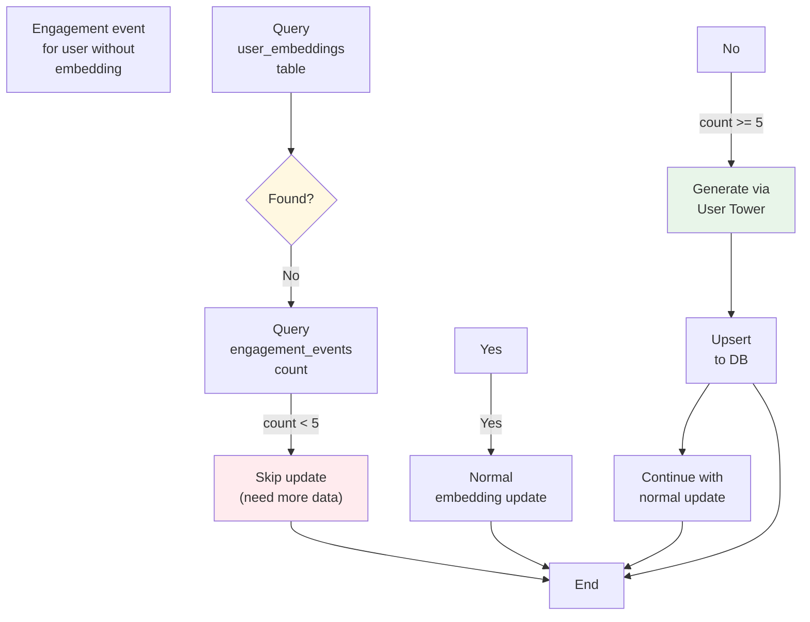
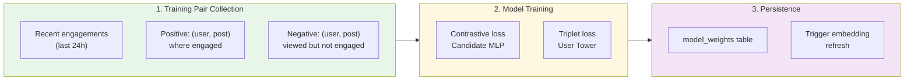
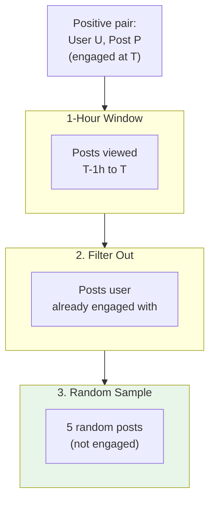
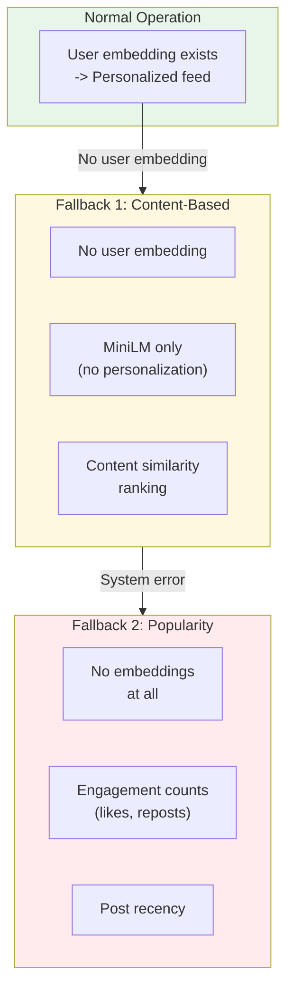

# Online Learning System

The online learning system continuously updates embeddings based on real-time user engagement, enabling personalization without requiring full model retraining.

## Overview



## Engagement Signal Types



## Real-Time User Embedding Update



## Real-Time Post Embedding Update



## Cold Start Flow



## Auto-Initialization Logic



## Batch Training Pipeline



### Negative Sampling Strategy



## Update Frequency

| Component | Trigger | Latency | Frequency |
|-----------|---------|---------|-----------|
| User Embedding | Engagement event | < 10ms | Every engagement |
| Post Embedding | Engagement event | < 10ms | Every engagement |
| Engagement Log | User action | < 10ms | Every action |
| Candidate MLP | 1000+ new pairs | ~30s | Hourly |
| User Tower | 128+ users | ~2min | Hourly |
| Full Embedding Refresh | Scheduled | ~5min | Daily |

## Fallback Strategies



## API Endpoints

### Trigger Engagement

```
POST /api/v1/engage
{
  "user_id": "uuid",
  "post_id": "uuid", 
  "event_type": "like" | "reply" | "repost" | "view" | "not_interested"
}
```

### Trigger User Embedding Generation

```
POST /api/v1/admin/user-embeddings/generate
{
  "user_id": "uuid",
  "min_engagements": 0
}
```

### Backfill All User Embeddings

```
POST /api/v1/admin/user-embeddings/backfill?min_engagements=0&batch_size=100
```

### Backfill Post Embeddings

```
POST /api/v1/recommendations/backfill-embeddings?batch_size=50
```

## Monitoring Metrics

| Metric | Target | Alert Threshold |
|--------|--------|-----------------|
| Embedding update latency | < 10ms | > 50ms |
| Training pair generation | > 100/hour | < 10/hour |
| Positive/Negative ratio | 1:5 to 1:10 | < 1:3 or > 1:20 |
| User embedding coverage | > 90% | < 70% |
| Cold start post CTR | > 1% | < 0.5% |
