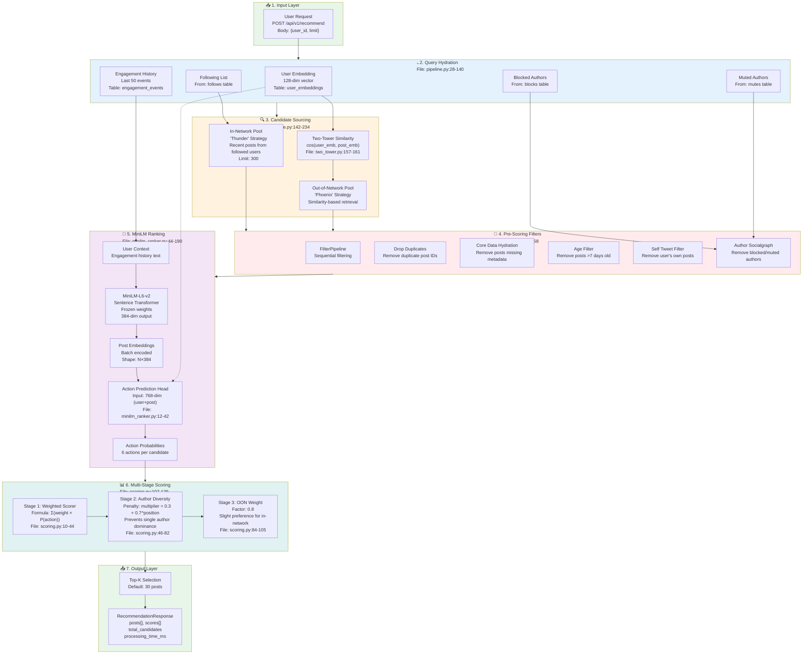
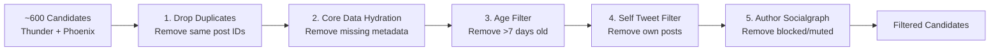

# Reranking Algorithm Architecture - Demo Reference

This document provides a comprehensive overview of the reranking system with detailed notes and file references for demo presentations.

---

## Main Architecture Overview



---

## Detailed Component Breakdown

### 1. Input Layer

**File:** `backend/app/api/recommendations.py:22-44`

```python
@router.post("/recommend", response_model=RecommendationResponse)
async def get_recommendations(request: RecommendationRequest):
    """
    Pipeline:
    1. Query Hydration (user embedding + following list)
    2. Candidate Sourcing (in-network + out-of-network)
    3. Pre-Scoring Filters
    4. MiniLM Ranking
    5. Weighted Scoring
    6. Top-K Selection
    """
```

**Key Points for Demo:**
- Single endpoint for all recommendations
- Returns `RecommendationResponse` with posts, scores, and metadata
- Processing time tracked for performance monitoring

---

### 2. Query Hydration

**File:** `backend/app/services/pipeline.py:28-140`

**Parallel Data Fetching:**
```python
# All 3 queries run concurrently using asyncio.gather
user_embedding, following, (blocked, muted) = await asyncio.gather(
    self.get_user_embedding(user_id),      # From user_embeddings table
    self.get_following_list(user_id),      # From follows table
    self.get_blocked_muted_authors(user_id) # From blocks/mutes tables
)
```

**Caching Strategy:**
- User embeddings: 5-minute Redis cache
- Following lists: 5-minute Redis cache
- Blocked/muted: 5-minute Redis cache

**Tables Accessed:**
- `user_embeddings` - 128-dim user vector
- `follows` - User's following relationships
- `blocks` - Blocked authors
- `mutes` - Muted authors

---

### 3. Candidate Sourcing (Dual Pool Strategy)

**File:** `backend/app/services/pipeline.py:142-234`

#### In-Network Pool ("Thunder")

```python
async def fetch_in_network_candidates(
    self, following: List[UUID], limit: int = 300
) -> List[PostCandidate]:
    # Fetch recent posts from followed users
    # Only top-level posts (not replies)
    # Ordered by created_at DESC
```

**Characteristics:**
- Source: Posts from followed users only
- Strategy: Recent first (chronological)
- Max Results: 300 (configurable via `THUNDER_MAX_RESULTS`)
- No ML scoring at this stage

#### Out-of-Network Pool ("Phoenix")

```python
async def fetch_out_of_network_candidates(
    self, user_embedding: np.ndarray, limit: int = 300
) -> List[PostCandidate]:
    # Two-tower similarity computation
    similarities = []
    for post_emb in post_embeddings:
        similarity = np.dot(user_embedding, post_emb)  # Cosine similarity
        similarities.append((post_id, similarity))
    
    # Sort by similarity and take top-K
    similarities.sort(key=lambda x: x[1], reverse=True)
```

**Two-Tower Similarity:**
- **File:** `backend/app/services/two_tower.py:157-161`
- Dot product = Cosine similarity (since vectors are L2 normalized)
- Top 500 posts considered for similarity computation

---

### 4. Pre-Scoring Filters

**File:** `backend/app/services/filters.py`

**Filter Pipeline Order:**



**Implementation:**
```python
class FilterPipeline:
    def __init__(self, user_id, blocked_authors, muted_authors):
        self.filters = [
            DropDuplicatesFilter(),           # Remove duplicate IDs
            CoreDataHydrationFilter(),        # Require text + author + date
            AgeFilter(max_age_days=7),        # Recent content only
            SelfTweetFilter(user_id),         # Don't show own posts
            AuthorSocialgraphFilter(blocked, muted)  # Respect user preferences
        ]
```

**Returns:** `(filtered_candidates, filter_stats)`
- Stats show how many removed by each filter
- Useful for debugging and monitoring

---

### 5. MiniLM Ranking (Action Prediction)

**File:** `backend/app/services/minilm_ranker.py`

#### Architecture Overview

```mermaid
flowchart TB
    subgraph UserBranch["User Encoding"]
        U1["User Context Text
(Engagement History)"] --> U2["MiniLM Tokenizer"] 
        U2 --> U3["MiniLM-L6-v2
Frozen Weights"]
        U3 --> U4["Mean Pooling"]
        U4 --> UE["User Embedding
384-dim"]
    end
    
    subgraph PostBranch["Post Encoding (Batch)"]
        P1["Candidate Posts
Text Array"] --> P2
