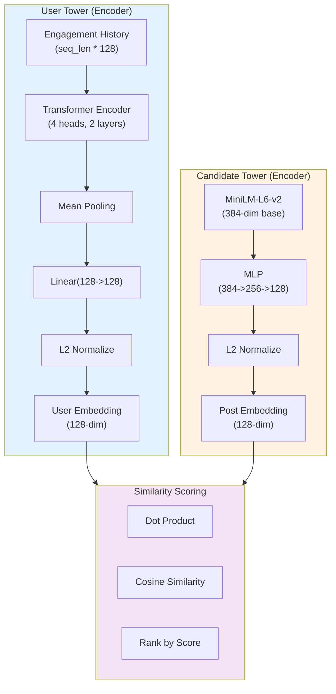
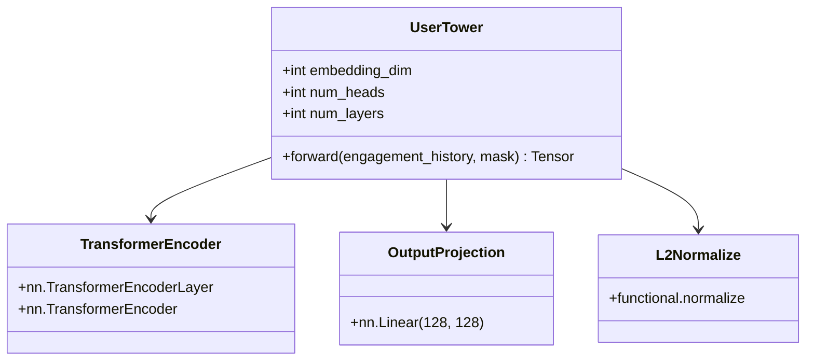
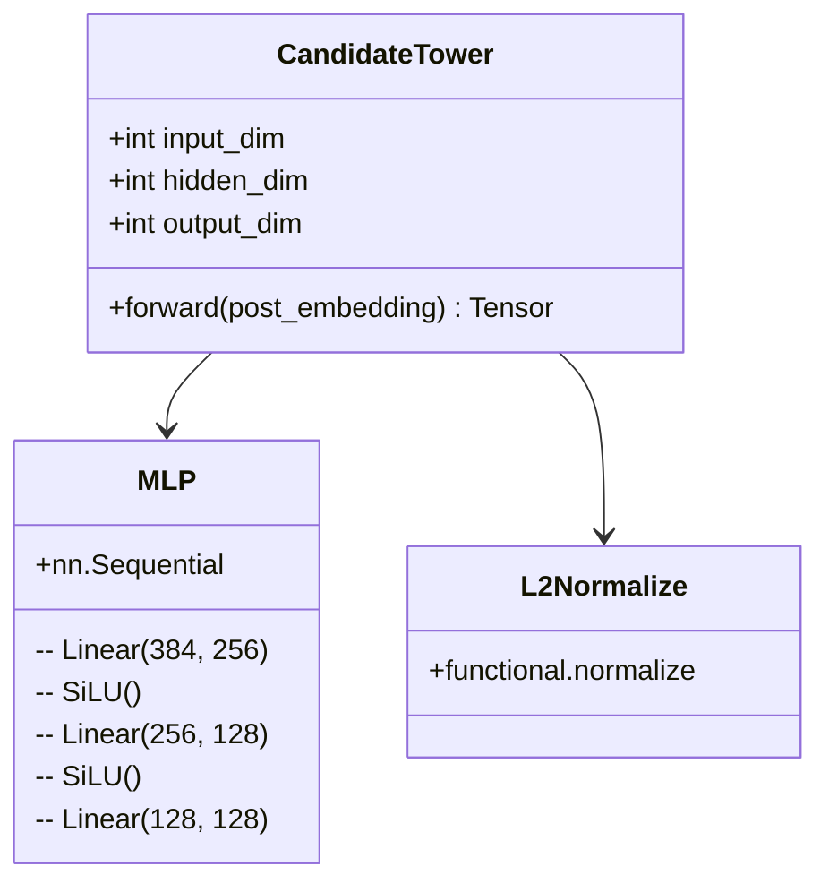
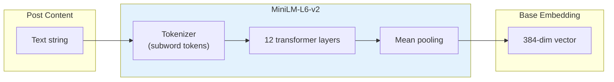
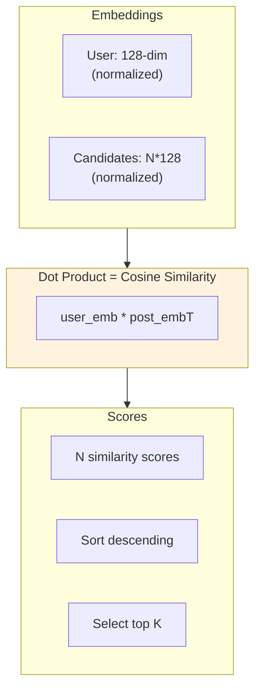
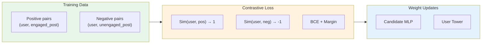

# Two-Tower Model Architecture

The Two-Tower neural network is the core of the recommendation system. It learns user preferences and content embeddings separately, then uses cosine similarity for retrieval.

## Architecture Diagram



## User Tower Details

### Architecture



### Input/Output

| Component | Shape | Description |
|-----------|-------|-------------|
| **Input** | `(batch, seq_len, 128)` | Engagement history of post embeddings |
| **Transformer** | `(batch, seq_len, 128)` | Self-attention over history |
| **Mean Pooling** | `(batch, 128)` | Average over sequence |
| **Projection** | `(batch, 128)` | Linear transform |
| **Output** | `(batch, 128)` | L2 normalized user embedding |

### Training Signal

The User Tower is trained via triplet loss:
- **Anchor**: User embedding at time t
- **Positive**: Post user engaged with after time t
- **Negative**: Random post from same time period

```python
loss = max(0, margin - positive_sim + negative_sim)
```

## Candidate Tower Details

### Architecture



### Input/Output

| Component | Shape | Description |
|-----------|-------|-------------|
| **Input** | `(batch, 384)` | MiniLM base embedding |
| **MLP** | `(batch, 128)` | 3-layer projection |
| **Output** | `(batch, 128)` | L2 normalized post embedding |

## MiniLM Pre-trained Encoder

The Candidate Tower uses a frozen MiniLM-L6-v2 encoder for content understanding:



## Similarity Computation



## Training Pipeline



## Hyperparameters

| Parameter | Value | Description |
|-----------|-------|-------------|
| **User Tower Layers** | 2 | Transformer encoder depth |
| **User Tower Heads** | 4 | Multi-head attention heads |
| **User Tower Dim** | 128 | User embedding dimension |
| **Candidate MLP Hidden** | 256 | Hidden layer size |
| **Post Embedding Dim** | 128 | Post embedding dimension |
| **MiniLM Dim** | 384 | Base encoding dimension |
| **Learning Rate** | 1e-4 | Adam optimizer |
| **Batch Size** | 32 | Training batch size |
| **Negative Samples** | 5 | Per positive example |
